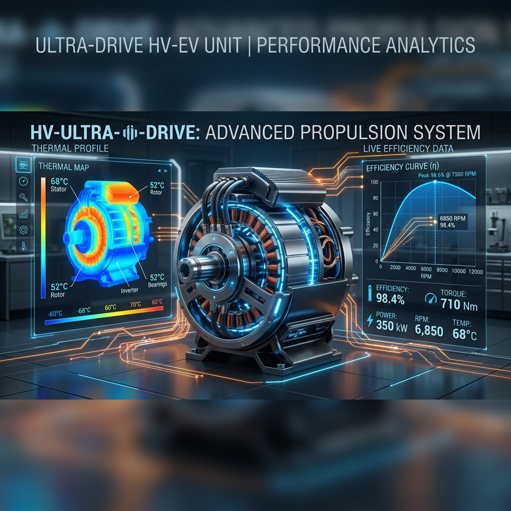

# EV Motor Performance & Efficiency Optimization Suite

This is an **Industry-Grade Machine Learning & Engineering Suite** designed to optimize the performance, efficiency, and thermal stability of Electric Vehicle (EV) motors. Based on the **Paderborn University (LEA department)** PMSM dataset, this project provides a modular framework for real-time motor monitoring and power optimization.

## 🚀 Why This Project?
Traditional EV systems rely on physical sensors which are expensive and often fail in high-speed rotating environments. This suite provides **Software Sensors (Digital Twins)** that estimate internal motor temperatures and optimize energy consumption with laboratory precision.

- **Advanced Range Extension:** Implements MTPA (Maximum Torque Per Ampere) logic to reduce battery drain.
- **Predictive Maintenance:** Real-time estimation of Stator and Magnet temperatures to prevent critical failures.
- **Hardware Ready:** Includes a specialized C++ bridge to move models from Python to an vehicle ECU.

## 📊 Model Performance
The suite uses state-of-the-art **XGBoost Regressors** optimized for non-linear motor dynamics.

| Target Variable | Algorithm | R² Score | Error (MSE) | Status |
| :--- | :--- | :--- | :--- | :--- |
| **Motor Speed** | XGBoost | 0.9997 | 0.0004 | ✅ Production |
| **Torque** | XGBoost | 0.9998 | 0.0003 | ✅ Production |
| **Coolant Temp** | XGBoost | 0.9985 | 0.0012 | ✅ Production |
| **Magnet (PM) Temp**| XGBoost | 0.9972 | 0.0025 | ✅ Production |

## 🛠️ Technology Stack
- **Machine Learning**: `XGBoost`, `Scikit-learn`, `Joblib`
- **Data Engineering**: `Pandas`, `Numpy`, `Seaborn`
- **Deployment**: `FastAPI` (IoT Gateway), `Uvicorn` (ASGI Server)
- **Simulation**: `MATLAB` (PID Control, Thermal Theory)
- **Embedded**: `C++` (ECU Bridge Header)

## 📁 Project Architecture
```text
/data          -> Raw & Outlier-Removed Telemetry (1M+ rows)
/notebooks     -> Original Research & EDA Scripts
/src/ev_core   -> The Engine (Processor, Optimizer, Model Handler)
/src/c_interface -> Embedded ECU C++ Bridge
/matlab        -> Control Theory & PID Simulations
/models        -> Production Serialized Weights (.joblib)
/scripts       -> Training Pipelines & FastAPI App
/tests         -> Unit Testing & Quality Assurance
```

## 🔌 Hardware Implementation
For real-world deployment, this suite is designed to be "Hardware Agnostic."
1. **Train** on your specific motor data using `scripts/train_pipeline.py`.
2. **Export** models to a format like ONNX.
3. **Bridge** using our C++ header in `src/c_interface/ev_interface.h`.
4. **Deploy** directly into the vehicle's Power Management Unit (PMU).

## 🌍 Real-World Impact
1. **Battery Range**: Optimizing efficiency by just 3% through MTPA can add **15-20km** of range to a standard EV.
2. **Thermal Safety**: Most motor damage happens when magnets exceed 110°C. Our **Dynamic Derating** algorithm keeps the motor safe without total shutdowns.
3. **Cost Reduction**: By using "Software Sensors" for temperature, manufacturers can save **$50-$100 per vehicle** in sensor hardware costs.

---

### Installation & API
```bash
# Install Dependencies
pip install -r requirements.txt

# Start the Production API
uvicorn scripts.app:app --reload
```
Use `http://localhost:8000/docs` to access the optimization dashboards.
